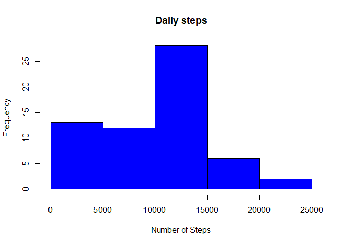
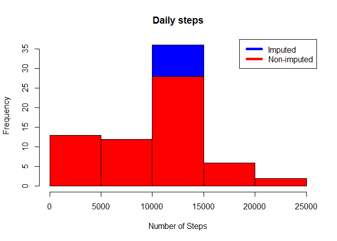
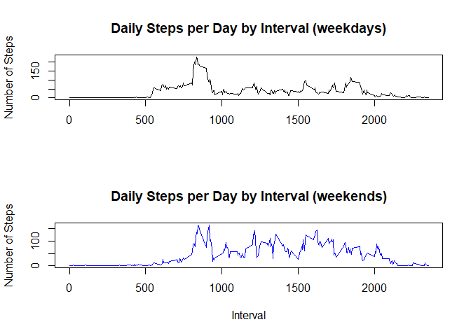

## Loading and preprocessing the data

```r
if(!file.exists("./data")){dir.create("./Projectdata")}
```

```
## Warning in dir.create("./Projectdata"): '.\Projectdata' already exists
```

```r
fileUrl <- "https://d396qusza40orc.cloudfront.net/repdata%2Fdata%2Factivity.zip"
download.file(fileUrl,destfile="./Projectdata/ProjectDataset.zip",method="curl")

unzip(zipfile="./Projectdata/ProjectDataset.zip",exdir="./Projectdata")
datapath <- file.path("./Projectdata")

activitydata<- read.csv(file.path(datapath,"activity.csv" ))
activitydata$date <- as.Date(activitydata$date, format="%Y-%m-%d")
```


## What is mean total number of steps taken per day?


```r
stepsperday <- as.data.frame(tapply(activitydata$steps, activitydata$date, sum, na.rm=T))
first <- hist(stepsperday$`tapply(activitydata$steps, activitydata$date, sum, na.rm = T)`, main = paste("Daily steps"), col="blue",xlab="Number of Steps")
```

<!-- -->

```r
first
```

```
## $breaks
## [1]     0  5000 10000 15000 20000 25000
## 
## $counts
## [1] 13 12 28  6  2
## 
## $density
## [1] 4.262295e-05 3.934426e-05 9.180328e-05 1.967213e-05 6.557377e-06
## 
## $mids
## [1]  2500  7500 12500 17500 22500
## 
## $xname
## [1] "stepsperday$`tapply(activitydata$steps, activitydata$date, sum, na.rm = T)`"
## 
## $equidist
## [1] TRUE
## 
## attr(,"class")
## [1] "histogram"
```

```r
mean(stepsperday[,1])
```

```
## [1] 9354.23
```

```r
median(stepsperday[,1])
```

```
## [1] 10395
```

## What is the average daily activity pattern?

```r
stepsbyinterval <- aggregate(steps ~ interval, activitydata, mean)
plot(stepsbyinterval$interval,stepsbyinterval$steps, type="l", xlab="Interval", ylab="Number of Steps",main="Average Number of Steps per Day by Interval")
```

<!-- -->

```r
stepsbyinterval[which.max(stepsbyinterval$steps),1]
```

```
## [1] 835
```


## Imputing missing values

```r
NAvalues <- sum(is.na(activitydata))
NAvalues
```

```
## [1] 2304
```

```r
fillNA <- numeric()
for (i in 1:nrow(activitydata)) {
    obs <- activitydata[i, ]
    if (is.na(obs$steps)) {
        steps <- subset(stepsbyinterval, interval == obs$interval)$steps
    } else {
        steps <- obs$steps
    }
    fillNA <- c(fillNA, steps)
}

noNAdata <- activitydata
noNAdata$steps <- fillNA

summary(noNAdata)
```

```
##      steps             date               interval     
##  Min.   :  0.00   Min.   :2012-10-01   Min.   :   0.0  
##  1st Qu.:  0.00   1st Qu.:2012-10-16   1st Qu.: 588.8  
##  Median :  0.00   Median :2012-10-31   Median :1177.5  
##  Mean   : 37.38   Mean   :2012-10-31   Mean   :1177.5  
##  3rd Qu.: 27.00   3rd Qu.:2012-11-15   3rd Qu.:1766.2  
##  Max.   :806.00   Max.   :2012-11-30   Max.   :2355.0
```

```r
stepsperday2 <- as.data.frame(tapply(noNAdata$steps, noNAdata$date, sum, na.rm=T))

hist(stepsperday2$`tapply(noNAdata$steps, noNAdata$date, sum, na.rm = T)`, main = paste("Daily steps"), col="blue",xlab="Number of Steps")
hist(stepsperday$`tapply(activitydata$steps, activitydata$date, sum, na.rm = T)`, col="red", xlab="Number of Steps", add=T)
legend("topright", c("Imputed", "Non-imputed"), col=c("blue", "red"), lwd=5)
```

<!-- -->

```r
mean(stepsperday2[,1])
```

```
## [1] 10766.19
```

```r
median(stepsperday2[,1])
```

```
## [1] 10766.19
```

```r
#YES, the values differ from the dataset without imputed NA values
```


## Are there differences in activity patterns between weekdays and weekends?

```r
noNAdata$weekday <- as.factor(weekdays(noNAdata$date))
weekday <- c("lunes","martes", "miércoles", "jueves", "viernes")
weekend <- c("sábado", "domingo")
dataweekday <- noNAdata[noNAdata$weekday %in% weekday,]
dataweekend <- noNAdata[noNAdata$weekday %in% weekend,]

stepsbyweekdays <- aggregate(steps ~ interval, dataweekday, mean)
stepsbyweekend <- aggregate(steps ~ interval, dataweekend, mean)

par(mfrow=c(2,1))
 plot(stepsbyweekdays$interval,stepsbyweekdays$steps, type="l", xlab="", ylab="Number of Steps",main="Daily Steps per Day by Interval (weekdays)")
 plot(stepsbyweekend$interval,stepsbyweekend$steps, type="l", xlab="Interval", ylab="Number of Steps",main="Daily Steps per Day by Interval (weekends)", col="blue")
```

<!-- -->
